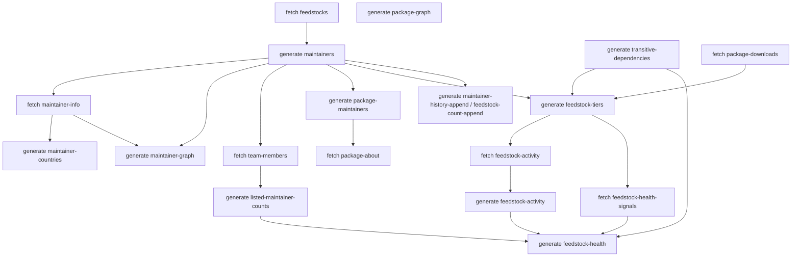

# Bootstrapping the data pipeline

This is the order to run the CLI in when you start with nothing. It mirrors
`.github/workflows/update.yml`. To run all of it in one go, use
[`scripts/bootstrap.sh`](../scripts/bootstrap.sh).

`feedstock-maintainers` and `fsm` are the same entrypoint. Every command has `--help`.

## Prerequisites

```sh
pixi install
pixi shell                       # or prefix commands with `pixi run`
export GITHUB_TOKEN='ghp_...'    # see "GitHub token" in the README
```

`fetch team-members` needs a token that can read the conda-forge org's teams. Use
`TEAM_READ_TOKEN` for that step if your normal token can't.

All files are written to the current directory unless you pass `--output`/`-o`.

## Dependency overview



## 1. Maintainer pipeline

```sh
# Recipes from every conda-forge feedstock -> recipe_cache/
fsm fetch feedstocks

# recipe_cache/ -> maintainers.json, package-names.json, licenses.json
fsm generate maintainers

# GitHub profile for each maintainer -> maintainer-info.json (slow; resumable)
fsm fetch maintainer-info

# maintainer-info.json -> maintainer-countries.json
fsm generate maintainer-countries

# -> maintainer-graph.json (used by the web app)
fsm generate maintainer-graph --output maintainer-graph.json

# Head counts for team handles like conda-forge/r.
# PRIVACY: team-members.json must never be cached or published. Delete it right away.
rm -f team-members.json
fsm fetch team-members
fsm generate listed-maintainer-counts
rm -f team-members.json
```

## 2. Package pipeline

```sh
# which maintainers look after each package -> package-maintainers.json
fsm generate package-maintainers

# These two download repodata.json.zst (hundreds of MB) for each platform
fsm generate package-graph -p linux-64 -p noarch --output package-graph.json
fsm generate transitive-dependencies -p linux-64 -p noarch --output transitive-dependencies.json

# Download counts from the Anaconda S3 parquet files -> package-downloads.json
fsm fetch package-downloads

# Package summaries etc. -> package-about.json
fsm fetch package-about --package-maintainers-file package-maintainers.json
```

`package-graph`, `transitive-dependencies` and `package-about` take platforms with repeated
`-p`/`--platform` options (e.g. `linux-64`, `noarch`, `osx-arm64`). They are the only commands
besides `fetch` that use the network. Each downloads the repodata itself, directly from
`https://conda.anaconda.org/conda-forge/<platform>/repodata.json.zst`.

## 3. Feedstock health

Tiers decide which feedstocks are worth the (expensive) per-repo GitHub queries.

```sh
fsm generate feedstock-tiers \
  --package-names-file package-names.json \
  --package-downloads-file package-downloads.json \
  --transitive-dependencies-file transitive-dependencies.json \
  --output feedstock-tiers.json

fsm fetch feedstock-activity --tiers-file feedstock-tiers.json --tier top \
  --output feedstock-activity-raw.json
fsm generate feedstock-activity \
  --raw-file feedstock-activity-raw.json --maintainers-file maintainers.json \
  --output feedstock-activity.json

fsm fetch feedstock-health-signals --tiers-file feedstock-tiers.json --tier top \
  --output feedstock-health-signals-raw.json
fsm generate feedstock-health \
  --signals-file feedstock-health-signals-raw.json \
  --maintainers-file maintainers.json \
  --activity-raw-file feedstock-activity-raw.json \
  --activity-file feedstock-activity.json \
  --package-names-file package-names.json \
  --transitive-dependencies-file transitive-dependencies.json \
  --output feedstock-health.json
```

On later runs add `--since <timestamp>` to the two `fetch` commands so only recently changed
feedstocks are re-queried. `fetch feedstock-health-signals` also takes `--limit N` to cap
how many feedstocks one run collects.

## 4. History

```sh
# One-off, slow: rebuild the full maintainer history from the GitHub API.
fsm fetch maintainer-history-backfill

# Recurring (monthly snapshots):
fsm generate maintainer-history-append
fsm fetch feedstock-count-history-backfill
fsm generate feedstock-count-append
```

## 5. Site

```sh
mkdir -p web/static/data
cp maintainer-graph.json web/static/data/
fsm generate site-data          # writes web/static/data/**
pixi run build-web
```

`site-data` requires `maintainers.json`, `maintainer-info.json`, `maintainer-graph.json`,
`package-names.json`, `package-maintainers.json`, `package-downloads.json`, `package-graph.json`
and `transitive-dependencies.json`. The other inputs are optional; missing ones are skipped
with a warning.

## Re-running

The fetch commands are resumable: entries already fetched are skipped. Pass `--force` to
refetch everything. In CI the whole directory is archived between runs; `cold-start.yml` seeds
the activity and health-signals data on a fresh start.
